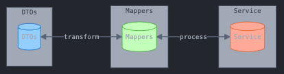

# Conjunto de recursos organizados por etapa en proyecto de software básico

## 1. Etapa: Configuración del proyecto

### 1.1 Estructura base del proyecto
* [Como generar un proyecto de Spring Boot](https://github.com/TheBootcampLibrary/spring-boot-template) - Repositorio con la estructura base y configuración inicial para proyectos Spring Boot

#### Contenido de la plantilla:
- Estructura base del proyecto tomando en cuenta las carpetas para las **querys** y sección de **algoritmos**
- Configuraciones iniciales de Spring Boot
- Dependencias básicas preconfiguradas recomendadas
- Archivos de configuración esenciales

### 1.2 Formateo y validacion de datos SQL
* [Formateador de inserts SQL](https://github.com/TheBootcampLibrary/sql-formatted) - Herramienta para formatear archivos para import.sql

#### Características principales:
- Convierte INSERTs de múltiples líneas a una sola línea
- Preserva la integridad de los datos y caracteres especiales UTF-8
- Implementación mediante Docker o uso local con python
- Mantiene los comentarios SQL


2. Comandos de instalación:
```bash
git clone https://github.com/TheBootcampLibrary/sql-formatted.git
docker-compose up
```


#### Consideraciones importantes:
- El archivo de entrada debe nombrarse `inserts.sql` (o especificarse en main.py)
- Debe estar en la misma carpeta que el `docker-compose.yml` o `python.py` 
- El archivo resultante se genera como `import.sql`
- Se requiere Docker instalado en el sistema o tener python en el squipo
- Los archivos deben usar codificación UTF-8
- Cada sentencia INSERT debe terminar con punto y coma (;) **IMPORTANTE**


## 2. Etapa: Modelos y entidades

### [SQLift](https://github.com/andressep95/SQLift) - Conversor de SQL a Entidades Java
Herramienta que transforma sentencias DDL de PostgreSQL a entidades Java con soporte para Hibernate y Lombok.


Requisitos:
- macOS (Apple Silicon/Intel) o Linux
- Acceso a terminal con permisos de instalación
- Docker instalado y en ejecución
- Permisos para comandos Docker


**NOTA:** Aunque se deben de crear todas las entidades del modelo de bases de datos no necesariamente deben de ser todas usadas.


## 3. Etapa: Repositories o Repositorios

```bash
@Repository
public interface ModelRepository extends JpaRepository<Model, ID> {
}
```

**NOTAS:**
- En donde Model viene siendo el nombre de la entidad que deseamos usar en el repositorio, basicamente desde que tabla se hacen las consultas a la BD.
- ID debe de ser reemplazado con el tipo de dato **Object** que tiene el **id** en su entidad, mayormante este es **Long** o **Integer**


Consulta con uso de filtros dinamicos escrita en JPQL: Este tipo de consultas se escribe empleando los nombres de las clases en Java y sus atributos.
```bash
@Query("""
        SELECT p.idPrograma, p.nombrePrograma, p.cantidadHora, c.codigoCurso, c.fechaInicio, c.fechaTermino
        FROM Programa p
        JOIN p.cursos c
        WHERE (:nombrePrograma IS NULL OR p.nombrePrograma LIKE %:nombrePrograma%)
        AND (:codigoCurso IS NULL OR c.codigoCurso LIKE :codigoCurso%)
    """)
    Page<Object[]> findAllProgramas(
        @Param("nombrePrograma") String nombrePrograma,
        @Param("codigoCurso") String codigoCurso,
        Pageable pageable); // JPQL
```


Consulta SQL nativa con filtros dinamicos: Este tipo de consultas se escribe empleando el nombre de las tablas de la base de datos y sus atributos.
```bash
 @Query(
        value = """
                SELECT p.id_programa, p.nombre_programa, p.cantidad_horas, 
                       c.codigo_curso, c.fecha_inicio, c.fecha_termino
                FROM programas p
                JOIN cursos c ON p.id_programa = c.id_programa
                WHERE (:nombrePrograma IS NULL OR p.nombre_programa LIKE %:nombrePrograma%)
                  AND (:codigoCurso IS NULL OR c.codigo_curso LIKE :codigoCurso%)
            """,
        countQuery = """
                SELECT COUNT(*)
                FROM programas p
                JOIN cursos c ON p.id_programa = c.id_programa
                WHERE (:nombrePrograma IS NULL OR p.nombre_programa LIKE %:nombrePrograma%)
                  AND (:codigoCurso IS NULL OR c.codigo_curso LIKE :codigoCurso%)
            """,
        nativeQuery = true)
    Page<Object[]> findAllProgramasNative(
        @Param("nombrePrograma") String nombrePrograma,
        @Param("codigoCurso") String codigoCurso,
        Pageable pageable); // SQL
```


### Para mas ejemplos puede visitar:
- https://github.com/Edutecno-Full-Stack-Java-Trainee-0084/InstitutoOpen/tree/main/src/main/java/com/edutecno/InstitutoOpen/repository

- https://github.com/Edutecno-Full-Stack-Java-Trainee-0084/Disco-Norte/tree/main/src/main/java/cl/playground/disco_norte/repository

- https://github.com/Edutecno-Full-Stack-Java-Trainee-0084/SpringSecurityJWT/tree/main/src/main/java/cl/playground/SpringSecurityBackend/repository

- https://github.com/Edutecno-Full-Stack-Java-Trainee-0084/TechShop-Plus/blob/main/src/main/java/cl/playground/techshop_plus/repository/OrderRepository.java

Todos los casos presentados utilizan paginacion en sus consultas.


## 4. Etapa: Service, Mappers y DTO´s

En esta etapa nos enfocamos en hacer la creacion y sustitucion de clases para usar a los **impostores (dtos)** que veamos convenientes para transferir la informacion de capa en capa
- 

**Ejemplo:**

- Para recuperar informacion de multiples tablas al mismo tiempo debemos:

 - **1. Recuperar informacion general de varias tablas en el repository**
```bash
@Repository
public interface MemberPurchaseRepository extends JpaRepository<MemberPurchase, Long> {

        @Query(value = """
            SELECT 
                mp.*
            FROM member_purchase mp
            INNER JOIN member m ON mp.member_id = m.member_id
            INNER JOIN membership_type mt ON m.membership_type_id = mt.membership_type_id
            INNER JOIN album a ON mp.album_id = a.album_id
            INNER JOIN branch b ON mp.branch_id = b.branch_id                        
            ORDER BY mp.member_purchase_id DESC
            LIMIT :#{#pageable.pageSize} 
            OFFSET :#{#pageable.offset}
            """,
            countQuery = """
                SELECT COUNT(*)
                FROM member_purchase
            """,
            nativeQuery = true)
    Page<MemberPurchase> findAllPurchasesWithDetails(Pageable pageable);

}
```


 - **2. Generar los DTO´s o impostores para poder almacenar esta informacion**

```bash
@Data
@Builder
public class MemberPurchaseResponseDTO {
    private Long purchaseId;
    private MemberDTO member;
    private AlbumDTO album;
    private String branchName;
    private int quantity;
    private int totalAmount;

    @Data
    @Builder
    public static class MemberDTO {
        private String fullName;
        private String membershipType;
    }

    @Data
    @Builder
    public static class AlbumDTO {
        private String title;
        private String artist;
        private int price;
    }

}
```


 - **3. Tener un mapper que permita la transferencia de la informacion obtenida del repositorio al DTO**

```bash
@Component
public class PurchaseMapper {

    public MemberPurchaseResponseDTO toDTO(MemberPurchase purchase) {
        return MemberPurchaseResponseDTO.builder()
                .purchaseId(purchase.getMemberPurchaseId())
                .member(MemberPurchaseResponseDTO.MemberDTO.builder()
                        .fullName(purchase.getMemberId().getFirstName() + " " + purchase.getMemberId().getLastName())
                        .membershipType(purchase.getMemberId().getMembership().getMembershipTypeDescription())
                        .build())
                .album(MemberPurchaseResponseDTO.AlbumDTO.builder()
                        .title(purchase.getAlbumId().getAlbumTitle())
                        .artist(purchase.getAlbumId().getArtistName())
                        .price(purchase.getAlbumId().getPrice())
                        .build())
                .branchName(purchase.getBranchId().getBranchDescription())
                .quantity(purchase.getQuantity())
                .totalAmount(purchase.getQuantity() * purchase.getAlbumId().getPrice())
                .build();
    }

    public Page<MemberPurchaseResponseDTO> toDTO(Page<MemberPurchase> purchases) {
        return purchases.map(this::toDTO);
    }
}
```


 - **4. Finalmente unimos los componentes en la capa de servicios**

```bash
@RequiredArgsConstructor
public class MemberPurchaseServicelmpl implements MemberPurchaseService {

    private final MemberPurchaseRepository repository;
    private final PurchaseMapper purchaseMapper;
    private final PurchaseDetailsMapper purchaseDetailsMapper;

    @Override
    @Transactional(readOnly = true) // Prgeunatr en la clase
    public Page<MemberPurchaseResponseDTO> getAllPurchases(Pageable pageable) {
        return purchaseMapper.toDTO(
                repository.findAllPurchasesWithDetails(pageable)
        );
    }
}
```


## 5. Etapa: Controladores Rest y View (Thymeleaf)


 - **1. Controlador para vistas (ViewController) enfocadas a un vista con filtro de busqueda**

```bash
@Controller
@RequestMapping("/programas") //url a la que responde el controlador
public class ProgramaViewController {

    private final ProgramaService programaService;

    public ProgramaViewController(ProgramaService programaService) {
        this.programaService = programaService;
    }

    @GetMapping
    public String getAllProgramas(
        @RequestParam(value = "nombrePrograma", required = false) String nombrePrograma,
        @RequestParam(value = "codigoCurso", required = false) String codigoCurso,
        @PageableDefault(page = 0, size = 10) Pageable pageable,
        Model model
        ) {

        // Manejar valores nulos o "null" explícitos
        if ("null".equalsIgnoreCase(nombrePrograma) || nombrePrograma == null) {
            nombrePrograma = "";
        }
        if ("null".equalsIgnoreCase(codigoCurso) || codigoCurso == null) {
            codigoCurso = "";
        }

        // Se obtienen los programas de manera paginada
        Page<ProgramaResponseDTO> programas = programaService.findAllProgramas(nombrePrograma, codigoCurso, pageable);

        // Se agregan los atributos al modelo para pasarlos a la vista
        model.addAttribute("programas", programas);
        model.addAttribute("currentPage", pageable.getPageNumber());
        model.addAttribute("totalPages", programas.getTotalPages());
        model.addAttribute("totalItems", programas.getTotalElements());

        // Mantener los filtros en la vista
        model.addAttribute("nombrePrograma", nombrePrograma);
        model.addAttribute("codigoCurso", codigoCurso);

        // Se retorna el nombre de la vista
        return "programas";
    }
}
```

**Notas:**
- nombreprograma, codigoCurso, page y size son parametros opcionales que contiene el metodo para entregar u organizar de cierta forma la informacion

- Antes de asignar los valores a los metodos o al model, usamos una validacion para no retornar estos campos como nulos, en vez de ello los retornamos como vacios **""**, para que no se vean reflejados en el HTML.


 - **2. Vista HTML con Thymeleaf y Bootstrap para gestionar de forma mas sencilla, responsiva y dinamica la interfaz que ve el cliente**

```HTML
<!DOCTYPE html>
<html xmlns:th="http://www.thymeleaf.org">
<head>
    <meta charset="UTF-8">
    <title>Lista de Programas</title>
    <link rel="stylesheet" href="https://cdn.jsdelivr.net/npm/bootstrap@5.3.0-alpha1/dist/css/bootstrap.min.css">
</head>
<body>
<div class="container mt-4">
    <h1 class="text-center">Lista de Programas</h1>

    <!-- Formulario de filtros -->
    <form th:action="@{/programas}" method="get" class="row g-3 mb-4">
        <div class="col-md-4">
            <label for="nombrePrograma" class="form-label">Nombre del Programa</label>
            <input type="text" id="nombrePrograma" name="nombrePrograma"
                   th:value="${nombrePrograma}" class="form-control">
        </div>
        <div class="col-md-4">
            <label for="codigoCurso" class="form-label">Código del Curso</label>
            <input type="text" id="codigoCurso" name="codigoCurso"
                   th:value="${codigoCurso}" class="form-control">
        </div>
        <div class="col-md-4 d-flex align-items-end">
            <button type="submit" class="btn btn-primary">Filtrar</button>
            <a th:href="@{/programas}" class="btn btn-secondary ms-2">Limpiar</a>
        </div>
    </form>

    <!-- Tabla de resultados -->
    <table class="table table-bordered table-striped">
        <thead class="table-dark">
        <tr>
            <th>ID</th>
            <th>Nombre del Programa</th>
            <th>Cantidad de Horas</th>
            <th>Código Curso</th>
            <th>Fecha Inicio</th>
            <th>Fecha Fin</th>
        </tr>
        </thead>
        <tbody>
        <!-- Iterar sobre los programas -->
        <tr th:each="programa : ${programas.content}">
            <td th:text="${programa.id}"></td>
            <td th:text="${programa.nombrePrograma}"></td>
            <td th:text="${programa.cantidadHoras}"></td>
            <td th:text="${programa.codigoCurso}"></td>
            <td th:text="${programa.fechaInicio}"></td>
            <td th:text="${programa.fechaFin}"></td>
        </tr>
        </tbody>
    </table>

    <nav th:if="${totalPages > 1}">
        <ul class="pagination justify-content-center">
            <!-- Página anterior -->
            <li class="page-item" th:classappend="${currentPage == 0} ? 'disabled'">
                <a class="page-link"
                   th:href="@{|/programas?page=${currentPage - 1}&size=10&nombrePrograma=${nombrePrograma}&codigoCurso=${codigoCurso}|}">
                    Anterior
                </a>
            </li>
            <!-- Páginas -->
            <li class="page-item" th:each="i : ${#numbers.sequence(0, totalPages - 1)}"
                th:classappend="${i == currentPage} ? 'active'">
                <a class="page-link"
                   th:href="@{|/programas?page=${i}&size=10&nombrePrograma=${nombrePrograma}&codigoCurso=${codigoCurso}|}"
                   th:text="${i + 1}"></a>
            </li>
            <!-- Página siguiente -->
            <li class="page-item" th:classappend="${currentPage == totalPages - 1} ? 'disabled'">
                <a class="page-link"
                   th:href="@{|/programas?page=${currentPage + 1}&size=10&nombrePrograma=${nombrePrograma}&codigoCurso=${codigoCurso}|}">
                    Siguiente
                </a>
            </li>
        </ul>
    </nav>


</div>
</body>
</html>
```

- **Primer componente: Filtro de busqueda**
```HTML
<form th:action="@{/programas}" method="get" class="row g-3 mb-4">
        <div class="col-md-4">
            <label for="nombrePrograma" class="form-label">Nombre del Programa</label>
            <input type="text" id="nombrePrograma" name="nombrePrograma"
                   th:value="${nombrePrograma}" class="form-control">
        </div>
        <div class="col-md-4">
            <label for="codigoCurso" class="form-label">Código del Curso</label>
            <input type="text" id="codigoCurso" name="codigoCurso"
                   th:value="${codigoCurso}" class="form-control">
        </div>
        <div class="col-md-4 d-flex align-items-end">
            <button type="submit" class="btn btn-primary">Filtrar</button>
            <a th:href="@{/programas}" class="btn btn-secondary ms-2">Limpiar</a>
        </div>
    </form>
```
Utiliza un formulario que envia la data en un metodo "GET" para poder reflejarla y usarla en la URL de la app.


- **Segundo componente: Tabla con elementos**
```HTML
<table class="table table-bordered table-striped">
        <thead class="table-dark">
        <tr>
            <th>ID</th>
            <th>Nombre del Programa</th>
            <th>Cantidad de Horas</th>
            <th>Código Curso</th>
            <th>Fecha Inicio</th>
            <th>Fecha Fin</th>
        </tr>
        </thead>
        <tbody>
        <!-- Iterar sobre los programas -->
        <tr th:each="programa : ${programas.content}">
            <td th:text="${programa.id}"></td>
            <td th:text="${programa.nombrePrograma}"></td>
            <td th:text="${programa.cantidadHoras}"></td>
            <td th:text="${programa.codigoCurso}"></td>
            <td th:text="${programa.fechaInicio}"></td>
            <td th:text="${programa.fechaFin}"></td>
        </tr>
        </tbody>
    </table>
```
Esta seccion se enfoca en recibir un objeto del tipo que retorna el controlador y presentar cada uno de sus atributos en una tabla, usando una especie de ciclo for en el cuerpo de la tabla para poder iterar sobre todos los datos contenidos


- **Tercer componente: Filtro de busqueda**
```HTML
    <nav th:if="${totalPages > 1}">
        <ul class="pagination justify-content-center">
            <!-- Página anterior -->
            <li class="page-item" th:classappend="${currentPage == 0} ? 'disabled'">
                <a class="page-link"
                   th:href="@{|/programas?page=${currentPage - 1}&size=10&nombrePrograma=${nombrePrograma}&codigoCurso=${codigoCurso}|}">
                    Anterior
                </a>
            </li>
            <!-- Páginas -->
            <li class="page-item" th:each="i : ${#numbers.sequence(0, totalPages - 1)}"
                th:classappend="${i == currentPage} ? 'active'">
                <a class="page-link"
                   th:href="@{|/programas?page=${i}&size=10&nombrePrograma=${nombrePrograma}&codigoCurso=${codigoCurso}|}"
                   th:text="${i + 1}"></a>
            </li>
            <!-- Página siguiente -->
            <li class="page-item" th:classappend="${currentPage == totalPages - 1} ? 'disabled'">
                <a class="page-link"
                   th:href="@{|/programas?page=${currentPage + 1}&size=10&nombrePrograma=${nombrePrograma}&codigoCurso=${codigoCurso}|}">
                    Siguiente
                </a>
            </li>
        </ul>
    </nav>
```
Cuenta con 3 secciones funcionales de uso:
- Boton para ir a las paginas iniciales (Izquierda)
- Enumeracion de cantidad de paginas generadas basadas en la division del numero total de elementos a servir entre la cantidad de elementos presentados por pagina
- Boton para ir a las paginas siguientes (Derecha)

Para mas informacion puede observar los siguientes recursos:
- https://github.com/Edutecno-Full-Stack-Java-Trainee-0084/InstitutoOpen/tree/main/src/main/resources/templates

- https://github.com/Edutecno-Full-Stack-Java-Trainee-0084/Disco-Norte/tree/main/src/main/resources/templates

- https://github.com/Edutecno-Full-Stack-Java-Trainee-0084/TechShop-Plus/tree/main/src/main/resources/templates


 - **3. Controlador Rest con filtro de busqueda**

```bash
@RestController
@RequestMapping("/api/v1/programas")
public class ProgramaRestController {

    private ProgramaService service;

    public ProgramaRestController(ProgramaService service) {
        this.service = service;
    }

    @GetMapping
    public ResponseEntity<Page<ProgramaResponseDTO>> getAllProgramas(
        @RequestParam(value = "nombrePrograma", required = false) String nombrePrograma,
        @RequestParam(value = "codigoCurso", required = false) String codigoCurso,
        @PageableDefault(page = 0, size = 10) Pageable pageable
                                                                    ) {
        Page<ProgramaResponseDTO> programa = service.findAllProgramas(nombrePrograma, codigoCurso, pageable);
        return ResponseEntity.ok(programa);
    }
}
```
**Notas:**
- nombrePrograma, codigoCurso, page y size son parametros opcionales que contiene el metodo para entregar u organizar de cierta forma la informacion

- El controller retorna informacion en formato JSON para ser probada en un navegador (Siempre y cuando sea una respuesta GET) o en herramientas como **Postman** o **Insomnia**


Para mas informacion puede observar los siguientes recursos:
- https://github.com/Edutecno-Full-Stack-Java-Trainee-0084/InstitutoOpen/blob/main/src/main/java/com/edutecno/InstitutoOpen/controller/ProgramaRestController.java

- https://github.com/Edutecno-Full-Stack-Java-Trainee-0084/SpringSecurityJWT/tree/main/src/main/java/cl/playground/SpringSecurityBackend/controller

- https://github.com/Edutecno-Full-Stack-Java-Trainee-0084/Disco-Norte/blob/main/src/main/java/cl/playground/disco_norte/controller/MemberPurchaseRestController.java

